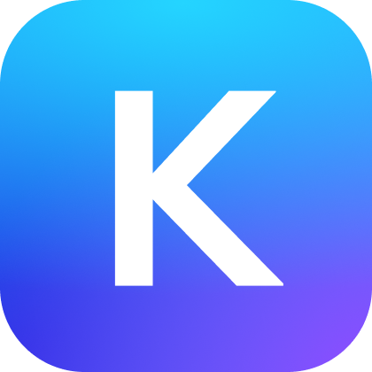

# Wallet Setup

To interact with the Persistence ecosystem, you'll need a supported wallet. Follow the instructions to set up one of the recommended wallets, and you’ll be ready to start trading, staking, and participating in governance.

##  Keplr Wallet: Perfect for interacting with the Cosmos ecosystem

&#x20;[Keplr Wallet](https://wallet.keplr.app/) is one of the wallets for interacting with the Persistence One ecosystem. Follow the instructions in the guide to download, install, and set up your wallet.

Visit [Keplr Wallet’s website](https://www.keplr.app/get) and follow along the steps to get started.



##  Leap Wallet: Your Gateway to the Cosmos Ecosystem&#x20;

Leap Wallet is a user-friendly and versatile wallet for interacting with the Persistence One ecosystem and the broader Cosmos network.

Follow these steps to set up Leap Wallet:

* Download and install the wallet from Leap Wallet's official website.
* Complete the guided setup process to securely create or import your wallet.

✨ **Get started with Leap Wallet** [Visit Leap Wallet's website](https://leapwallet.io) and follow the instructions to dive into the Persistence ecosystem.


