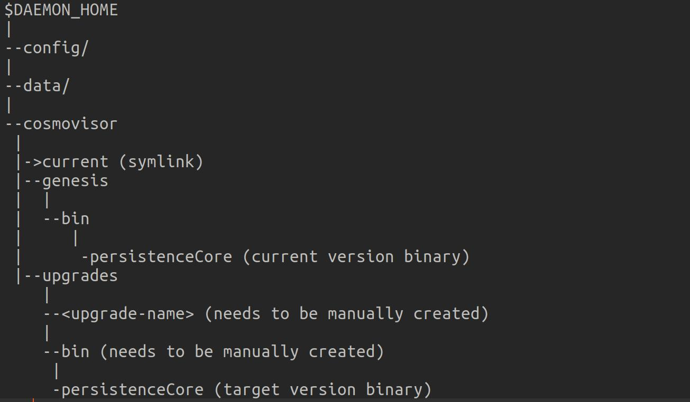

# Cosmovisor

_This doc is to be reviewed and updated_

**cosmovisor** is a small process manager for any Cosmos SDK based application binaries that monitors the governance module for incoming **chain upgrade proposals**. If it sees a proposal that gets approved, cosmovisor can automatically download the new binary, stop the current binary, switch from the old binary to the new one, and finally restart the node with the new binary.

For detailed information related to cosmovisor, refer here: [cosmos-sdk doc](https://docs.cosmos.network/main/tooling/cosmovisor).

## Auto-Download feature

If the system administrator plans the Persistence chain upgrade using Cosmovisor, generally the upgrade and current binaries need to be manually placed on the disk before the upgrade happens.  

Once the cosmovisor procsess is started, below folder structure is automatically created in the chain directory:-  



Before the chain upgrade, target version chain binary needs to be added under cosmovisor/upgrades/<upgrade-name>/bin directory manually.
However, for people who don't need such control and want an automated setup to download binaries on all the validating nodes, there is an **auto-download** option.

### Steps to enable the Auto-Download feature
1. Ensure to set environment variable **DAEMON_ALLOW_DOWNLOAD_BINARIES** to **true** before starting the cosmovisor process
2. Create a github release for target version binary/tar for all required environments and calculate the checksum using sha256sum or sha512sum. The downloadable binary path with checksum can be drafted then as below:
    ```   
    "https://github.com/cosmos/gaia/releases/download/v8.0.0/gaiad-v8.0.0-linux-amd64?checksum=sha256:6d0c123e246a8b56ba534f70dd5dc72058b00fd5e5dde5ea40509ff51efc42e2"
    ```
3. Create a JSON file in format:- os/architecture -> binary URI map under the "binaries" key. Note that we can list multiple binaries for appropriate environments in this file.  
   For example:
    ```json
    {
      "binaries": {
        "linux/amd64": "https://github.com/cosmos/gaia/releases/download/v8.0.0/gaiad-v8.0.0-linux-amd64?checksum=sha256:6d0c123e246a8b56ba534f70dd5dc72058b00fd5e5dde5ea40509ff51efc42e2"
        "linux/arm64": "https://github.com/cosmos/gaia/releases/download/v8.0.0/gaiad-v8.0.0-linux-arm64?checksum=sha256:a0afbbe35eda3d5e52a7907bcae296415e84b3ff6c7da97429d91f324004a5ab"
      }
    }
    ```
    Host this JSON file(<any-upgrade-name>.JSON) to a target version github Release or create a separate gist/webpage.  
    Lets say for example, we added it to Release downloads page like:- "https://github.com/persistenceOne/persistenceCore/releases/download/v7.0.0/v7_binaries.json"
   
4. To download the target binary during upgrade, we need to provide full path for above raw JSON file into upgrade-info parameter while submitting upgrade proposal from each of the node in the current running chain.
For example:-
    ```shell
    persistenceCore tx gov submit-proposal software-upgrade $UPGRADE_NAME --yes --title "$UPGRADE_NAME" --description "$UPGRADE_NAME" \
        --upgrade-height $UPGRADE_HEIGHT --from val1 --chain-id $CHAIN_ID --deposit 100uxprt \
        --upgrade-info "https://github.com/persistenceOne/persistenceCore/releases/download/v7.0.0/raw/v7_binaries.json" \
        --fees 2000uxprt --gas auto --gas-adjustment 1.5 -b block -o json
    ```
### How it works?
1. If DAEMON_ALLOW_DOWNLOAD_BINARIES is set to true, and no local binary can be found when an upgrade is triggered, cosmovisor will attempt to download and install the binary itself based on the "binaries" field in JSON specified in "upgrade-info" field while passing the proposal. 
2. The new binary will be downloaded with go-getter, and unpack the new binary in the upgrades/<name> folder so that it can be run as if it was installed manually.


##### NOTES
1. go-getter will always ensure the downloaded file matches with the provided checksum. 
2. cosmovisor will set the current link to point to genesis at first start (i.e. when no current link exists) and then handle switching binaries at the correct points in time so that the system administrator can prepare days in advance and relax at upgrade time.
3. In order to support downloadable binaries, a tarball for each upgrade binary will need to be packaged up and made available through a canonical URL. Additionally, a tarball that includes the genesis binary and all available upgrade binaries can be packaged up and made available so that all the necessary binaries required to sync a fullnode from start can be easily downloaded.