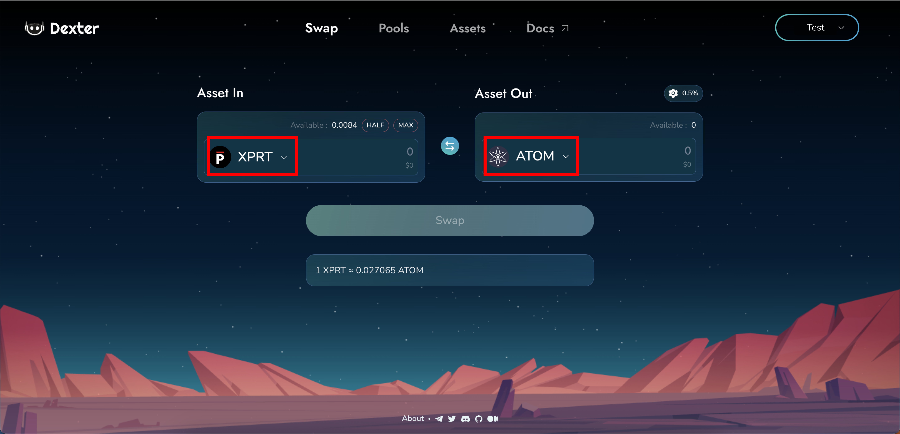

# Trading Assets

Follow the steps below to perform a swap between assets on Persistence DEX:

* **Step 1** - Head over to the Persistence DEX App ([https://app.persistence.one/assets](https://app.persistence.one/assets)). The home page is the Swap page.

<figure><figcaption></figcaption></figure>

* **Step 2** - To change an asset click on the arrow beside the token name on each block and a popup would appear.

<figure><figcaption></figcaption></figure>

You may now either select the token of your choice and repeat the process for the remainder of the pair.

<figure><figcaption></figcaption></figure>

* **Step 3** - Enter the desired amount you wish to swap.

<figure><figcaption></figcaption></figure>

The expected amount would be displayed on the app.

* **Step 4**- Confirm swap by clicking on the "Swap" button.

<figure><figcaption></figcaption></figure>

* **Step 5** - Approve the Transaction on your wallet.

<figure><figcaption></figcaption></figure>

A snack bar will be displayed once the transaction is confirmed.

<figure><figcaption></figcaption></figure>

Congratulations! You've made a swap on Persistence DEX.

## Setting Slippage 


Slippage tolerance is the acceptable change in price during the execution of the trade.


Click on the "gear" icon on the right side of the screen, a popup would show up with a text box.

<figure><figcaption></figcaption></figure>

Either select the predetermined slippage tolerance by clicking on the button or enter your desired input and click on "Save Settings".

<figure><figcaption></figcaption></figure>
