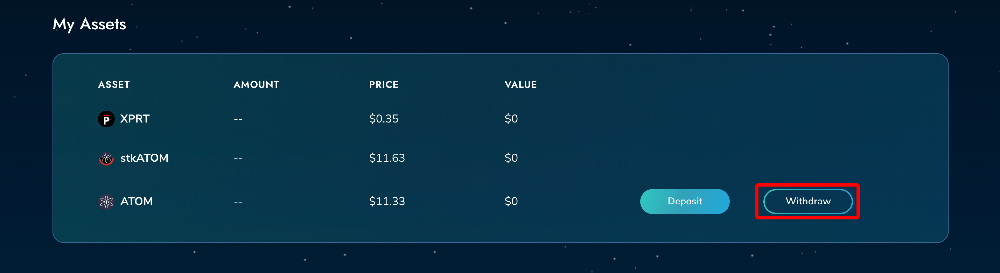

# Managing Assets

## Managing Assets

Persistence DEX is an Interchain DEX and supports assets from other Cosmos chains. Users can deposit assets from other IBC-enabled chains in the Cosmos ecosystem ⚛️​

### Deposit Assets 

* **Step 1** - Click on "Deposit" beside the assets you want to deposit on the Assets page ([https://app.persistence.one/assets](https://app.persistence.one/assets))

<figure><figcaption></figcaption></figure>

* **Step 2** - Enter the preferred amount to deposit and click "Deposit" button on the popup.

<figure><figcaption></figcaption></figure>

* **Step 3** - Approve the IBC transaction to transfer the assets from other chains.

<figure><figcaption></figcaption></figure>

You will receive a confirmation once the transaction is confirmed with the link to view the transaction details on Mintscan Explorer.

<figure><figcaption></figcaption></figure>

## Withdrawing Assets

Follow the steps below to withdraw assets to the source chain from Persistence Core-1.

* **Step 1**- Click on "Withdraw" beside the asset on the "My Asset" section on the Assets page ([https://app.persistence.one/assets](https://app.persistence.one/assets))

<figure><figcaption></figcaption></figure>

* **Step 2** - Enter the preferred amount to withdraw and click "Withdraw" button on the popup.

<figure><figcaption></figcaption></figure>

* **Step 3** - Approve the IBC transaction to withdraw the assets back to the source chain.

<figure><figcaption></figcaption></figure>
