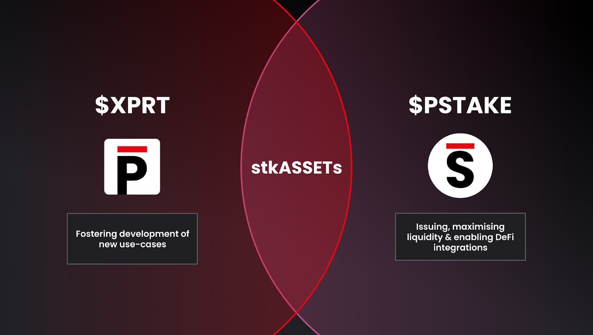

# $XPRT-$PSTAKE Relationship

The pSTAKE protocol is currently being built on top of the Persistence Core-1 chain in a **modular fashion**, to support the **issuance of** **stkASSETs on the Persistence chain**. Users will deposit their native assets (such as ATOM, LUNA, JUNO, etc.) on the Persistence Core-1 chain (via the pSTAKE liquid staking module) to issue IBC-enabled stkASSETs against their staked assets. Issuance of stkASSETs will help to **grow the total value locked (TVL) on the Persistence Core-1 chain**.

In order to use these stkASSETs within the Persistence ecosystem, users will **pay gas fees in the form of XPRT**, accruing value to XPRT. stkASSETs will also be integrated with apps outside the Persistence ecosystem, using the Core-1 chain as a hub to route the flow of stkASSETs.

